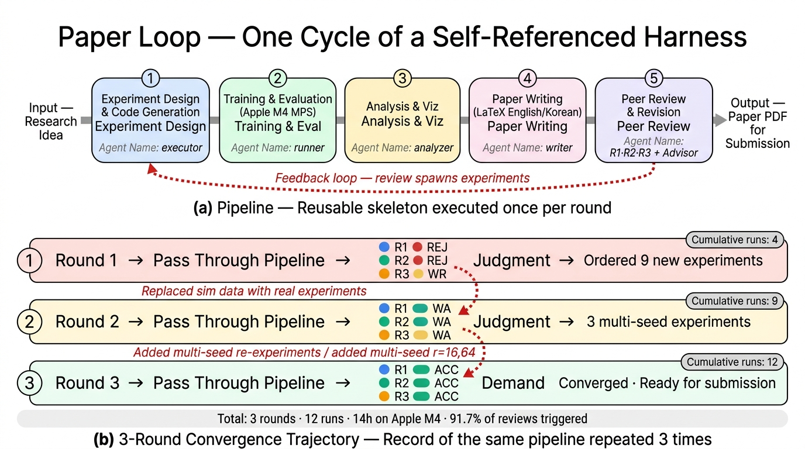

# aiicon — Claude Code skill for AAICon 1-page abstracts

Fill a Korean-conference one-page abstract template (`.docx`) with title,
authors, body, and a figure. Optionally auto-generate the figure via the
OpenAI Codex CLI's `image_generation` tool.

Bundled with the **AAICon 2026** template, but works with any template
that shares the same 4-row title table + 2-row figure table layout.

<p align="center">
  
</p>

## Install

Clone into your Claude Code skills directory:

```bash
git clone https://github.com/jkf87/aiicon.git ~/.claude/skills/aiicon
```

Claude Code auto-discovers the skill on next launch. Invoke with
`/aiicon` or by asking naturally — e.g. "AAICon 초록 docx 만들어줘".

### Requirements

- Python 3.10+ with `python-docx` and `pyyaml`:
  ```bash
  pip install python-docx pyyaml
  ```
- **LibreOffice** (`soffice`) for the PDF preview step. Optional:
  `pdftoppm` (PNG render) and `pdfinfo` (page-count check).
- Korean fonts (맑은 고딕 / Malgun Gothic) on the rendering machine.
- **Codex CLI** logged in (`codex login status`) — only if you want
  auto-generated figures. Prefer the user install
  (`~/.npm-global/bin/codex`) over `/usr/local/bin/codex`; the script
  requires `codex responses` support.

## Quick start

```bash
# 1. Copy the example config
cp references/example_config.yaml my_abstract.yaml
# 2. Edit title / authors / body / figure path
# 3. Build the docx
python scripts/build_abstract.py --config my_abstract.yaml --out my_abstract.docx
# 4. Preview as PDF + PNG (exit code 2 = page overflow)
python scripts/render_preview.py my_abstract.docx --png
```

### Auto-generate the figure (optional)

Omit `figure.image` and add a `figure.generate` block instead:

```yaml
figure:
  caption: "..."
  width_mm: 125
  generate:
    prompt: |
      Clean vector illustration of a 5-stage paper-production harness
      (executor → runner → analyzer → writer → peer review) with a
      red dashed feedback arrow from review back to stage 1. English
      labels only, flat design, light background.
    aspect: landscape          # square | landscape | portrait
```

The builder calls `scripts/generate_figure.py`, which pipes a Responses
API payload to `codex -c mcp_servers={} responses`, extracts the base64
PNG from the JSONL stream, and caches it next to your config. See
`references/figure_generation.md` for details.

## Repository layout

```
aiicon/
├── SKILL.md                        Claude loader entry
├── README.md                       this file
├── LICENSE
├── assets/
│   ├── aaicon_template.docx        AAICon 2026 official template
│   └── example_figure.jpeg         smoke-test figure
├── scripts/
│   ├── build_abstract.py           YAML → filled .docx
│   ├── render_preview.py           .docx → .pdf (+ PNG), page-count gate
│   └── generate_figure.py          standalone Codex image generator
└── references/
    ├── config_schema.md            full YAML schema
    ├── example_config.yaml         annotated sample
    ├── template_structure.md       AAICon template cell map
    ├── custom_templates.md         adapting to non-AAICon templates
    ├── one_page_fit.md             in-order levers to hit 1 page
    └── figure_generation.md        Codex CLI setup + prompt tips
```

## Credits

The Codex image-generation flow is a standalone port of
[**jkf87/openclaw-codex-image-gen**](https://github.com/jkf87/openclaw-codex-image-gen)
— the same JSONL payload and extraction path, without the OpenClaw
plugin runtime dependency.

The AAICon 2026 abstract template is © AI Friends Conference and is
redistributed here solely for authors submitting to that venue.

## License

MIT — see [LICENSE](LICENSE).
