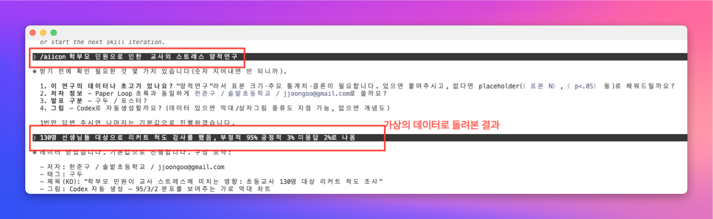
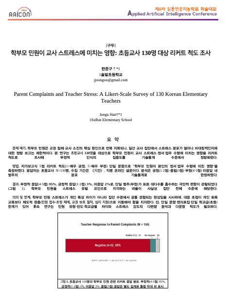

# aiicon — AAICon 1페이지 초록용 Claude Code 스킬

한국어 학술대회 1페이지 초록 템플릿(`.docx`)에 제목·저자·본문·그림을
채워 넣습니다. **AAICon 2026** 공식 템플릿이 기본 포함되어 있으며, 제목
테이블(4×1) + 그림 테이블(2×1) 구조를 따르는 다른 템플릿도 사용 가능.
그림은 OpenAI Codex CLI의 `image_generation` 툴로 자동 생성할 수 있습니다.

## 사용 모습

`/aiicon <주제>`로 호출하면 스킬이 빠진 항목을 질문하고, 1페이지
`.docx`를 생성합니다. 아래 예시: 학부모 민원으로 인한 교사 스트레스
양적 연구(N=130, 리커트).

**1. 호출 및 확인 질문**



**2. 최종 렌더링된 1페이지 출력**



## 설치

**한 줄 설치:**

```bash
git clone https://github.com/jkf87/aiicon.git ~/.claude/skills/aiicon
```

이후 Claude Code를 재시작하거나 `/reload-plugins`를 실행합니다. 호출은
`/aiicon <주제>` 또는 자연어("AAICon 초록 docx 만들어줘")로 가능.

### 필수 환경

- Python 3.10+ / `python-docx` / `pyyaml`:
  ```bash
  pip install python-docx pyyaml
  ```
- **LibreOffice** (`soffice`) — PDF 미리보기용. 선택: `pdftoppm`(PNG
  렌더), `pdfinfo`(페이지 수 검증).
- 한글 폰트(맑은 고딕 / Malgun Gothic) — 렌더 머신에 설치되어 있어야
  글자가 제대로 표시됩니다.
- **Codex CLI** 로그인(`codex login status`) — 그림 자동 생성을
  쓸 때만 필요. `~/.npm-global/bin/codex`(사용자 설치) 우선, `codex
  responses` 서브커맨드가 지원되는 버전이어야 합니다.

## 빠른 시작

```bash
# 1. 예시 config 복사
cp references/example_config.yaml my_abstract.yaml
# 2. 제목 / 저자 / 본문 / 그림 경로 편집
# 3. docx 빌드
python scripts/build_abstract.py --config my_abstract.yaml --out my_abstract.docx
# 4. PDF + PNG 미리보기 (exit code 2 = 1페이지 초과)
python scripts/render_preview.py my_abstract.docx --png
```

### 그림 자동 생성

`figure.image`를 지우고 `figure.generate` 블록을 추가하면
`scripts/generate_figure.py`가 Codex `responses` API에 JSON 페이로드를
전달해 PNG를 받아 캐시합니다. 자세한 내용은
`references/figure_generation.md`.

```yaml
figure:
  caption: "..."
  width_mm: 125
  generate:
    prompt: |
      Clean vector illustration of a 5-stage paper-production harness
      (executor → runner → analyzer → writer → peer review) with a
      red dashed feedback arrow from review back to stage 1. English
      labels only, flat design, light background.
    aspect: landscape          # square | landscape | portrait
```

## 저장소 구조

```
aiicon/
├── SKILL.md                        Claude 로더 진입점
├── README.md                       현재 파일
├── LICENSE
├── assets/
│   ├── aaicon_template.docx        AAICon 2026 공식 템플릿
│   ├── example_figure.jpeg         스모크 테스트용 그림
│   └── screenshots/                README 임베드 이미지
├── scripts/
│   ├── build_abstract.py           YAML → 채워진 .docx
│   ├── render_preview.py           .docx → .pdf (+ PNG), 페이지 수 게이트
│   └── generate_figure.py          Codex 이미지 생성 단독 스크립트
└── references/
    ├── config_schema.md            전체 YAML 스키마
    ├── example_config.yaml         주석 달린 예시
    ├── template_structure.md       AAICon 템플릿 셀 맵
    ├── custom_templates.md         다른 템플릿 적응 가이드
    ├── one_page_fit.md             1페이지 맞춤 전략
    └── figure_generation.md        Codex CLI 설정 + 프롬프트 팁
```

## 크레딧

Codex 그림 생성 흐름은
[**jkf87/openclaw-codex-image-gen**](https://github.com/jkf87/openclaw-codex-image-gen)의
핵심 경로를 OpenClaw 플러그인 런타임 의존성 없이 단독 스크립트로 포팅한
것입니다. JSONL 페이로드·추출 로직 동일.

AAICon 2026 초록 템플릿 저작권은 ㈜AI프렌즈 학회에 있으며, 해당 학회에
투고하는 저자용으로만 재배포합니다.

## 라이선스

MIT — [LICENSE](LICENSE) 참조.

---

<details>
<summary><strong>English README (click to expand)</strong></summary>

# aiicon — Claude Code skill for AAICon 1-page abstracts

Fill a Korean-conference one-page abstract template (`.docx`) with title,
authors, body, and a figure. Optionally auto-generate the figure via the
OpenAI Codex CLI's `image_generation` tool.

Bundled with the **AAICon 2026** template, but works with any template
that shares the same 4-row title table + 2-row figure table layout.

## In use

Invoke `/aiicon` with a research topic — the skill prompts for the
missing fields, then produces a filled `.docx`. Example below: a
quantitative study on teacher stress from parent complaints (N=130,
Likert) run end-to-end.

**1. Invocation and clarifying questions**


**2. Rendered one-page output**


## Install

**One command:**

```bash
git clone https://github.com/jkf87/aiicon.git ~/.claude/skills/aiicon
```

Then restart Claude Code (or run `/reload-plugins`). Invoke with
`/aiicon <topic>` or ask naturally — e.g. "AAICon 초록 docx 만들어줘".

### Requirements

- Python 3.10+ with `python-docx` and `pyyaml`:
  ```bash
  pip install python-docx pyyaml
  ```
- **LibreOffice** (`soffice`) for the PDF preview step. Optional:
  `pdftoppm` (PNG render) and `pdfinfo` (page-count check).
- Korean fonts (맑은 고딕 / Malgun Gothic) on the rendering machine.
- **Codex CLI** logged in (`codex login status`) — only if you want
  auto-generated figures. Prefer the user install
  (`~/.npm-global/bin/codex`) over `/usr/local/bin/codex`; the script
  requires `codex responses` support.

## Quick start

```bash
# 1. Copy the example config
cp references/example_config.yaml my_abstract.yaml
# 2. Edit title / authors / body / figure path
# 3. Build the docx
python scripts/build_abstract.py --config my_abstract.yaml --out my_abstract.docx
# 4. Preview as PDF + PNG (exit code 2 = page overflow)
python scripts/render_preview.py my_abstract.docx --png
```

### Auto-generate the figure (optional)

Omit `figure.image` and add a `figure.generate` block instead:

```yaml
figure:
  caption: "..."
  width_mm: 125
  generate:
    prompt: |
      Clean vector illustration of a 5-stage paper-production harness
      (executor → runner → analyzer → writer → peer review) with a
      red dashed feedback arrow from review back to stage 1. English
      labels only, flat design, light background.
    aspect: landscape          # square | landscape | portrait
```

The builder calls `scripts/generate_figure.py`, which pipes a Responses
API payload to `codex -c mcp_servers={} responses`, extracts the base64
PNG from the JSONL stream, and caches it next to your config. See
`references/figure_generation.md` for details.

## Repository layout

```
aiicon/
├── SKILL.md                        Claude loader entry
├── README.md                       this file
├── LICENSE
├── assets/
│   ├── aaicon_template.docx        AAICon 2026 official template
│   ├── example_figure.jpeg         smoke-test figure
│   └── screenshots/                README-embedded images
├── scripts/
│   ├── build_abstract.py           YAML → filled .docx
│   ├── render_preview.py           .docx → .pdf (+ PNG), page-count gate
│   └── generate_figure.py          standalone Codex image generator
└── references/
    ├── config_schema.md            full YAML schema
    ├── example_config.yaml         annotated sample
    ├── template_structure.md       AAICon template cell map
    ├── custom_templates.md         adapting to non-AAICon templates
    ├── one_page_fit.md             in-order levers to hit 1 page
    └── figure_generation.md        Codex CLI setup + prompt tips
```

## Credits

The Codex image-generation flow is a standalone port of
[**jkf87/openclaw-codex-image-gen**](https://github.com/jkf87/openclaw-codex-image-gen)
— the same JSONL payload and extraction path, without the OpenClaw
plugin runtime dependency.

The AAICon 2026 abstract template is © AI Friends Conference and is
redistributed here solely for authors submitting to that venue.

## License

MIT — see [LICENSE](LICENSE).

</details>
